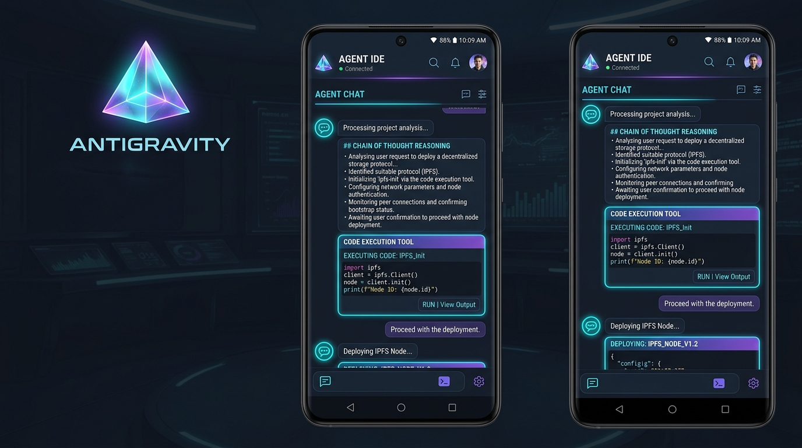
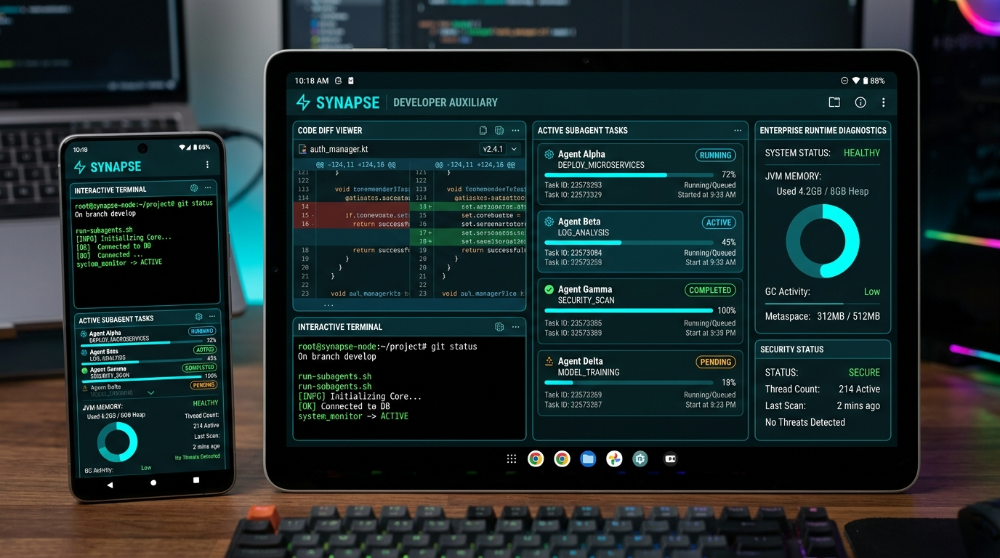
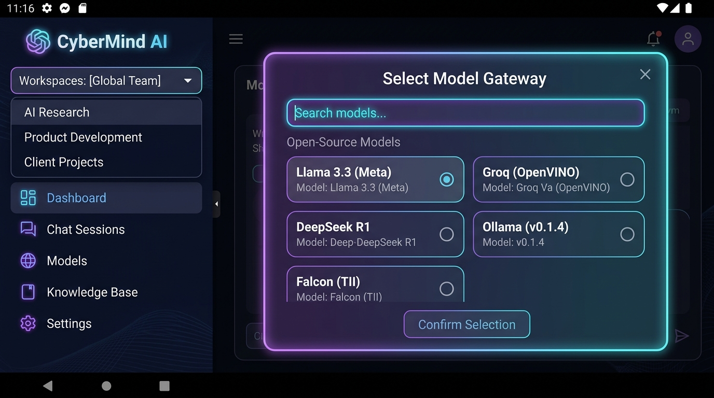
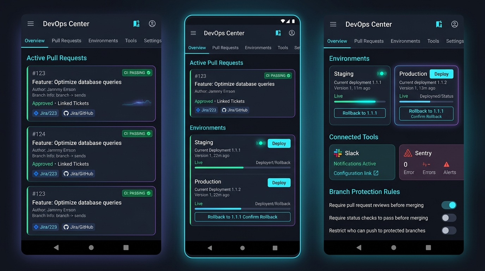
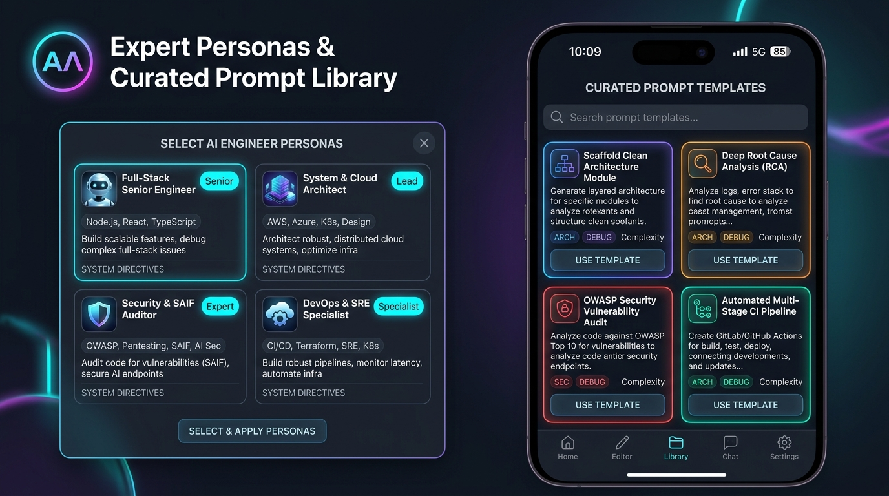

# Antigravity Mobile 🚀

[](https://github.com/saileshkushwaha/antigravity-mobile/actions/workflows/build-apk.yml)
[](https://kotlinlang.org)
[](https://developer.android.com/jetpack/compose)
[](https://m3.material.io)
[](https://developer.android.com)
[](LICENSE)

**Antigravity Mobile** brings the full power, signature dark cyber aesthetic, and multi-surface workflows of the **Google Antigravity Desktop App** to Android devices. Built natively with **Kotlin**, **Jetpack Compose**, and **Material 3**, it provides an enterprise-ready mobile IDE and autonomous agent execution studio.

---

## 📱 Look & Feel Overview



The interface is engineered around an authentic **Dark Studio Theme** (`#101216` canvas, `#1E2128` surfaces) accented with signature neon tones:
- **Electric Cyan** (`#00E5FF`): Agent streams, active links, and tool indicators.
- **Nebula Violet** (`#8B5CF6`): Planning mode, gateway selections, and primary actions.
- **Diff Emerald** (`#10B981`): Code additions and successful tool executions.
- **Warning Amber** (`#F59E0B`): Planning approvals, notifications, and cautions.
- **Error Ruby** (`#EF4444`): Guardrail blocks and test failures.

---

## 🏛 Architecture & Surface Layout

Antigravity Mobile preserves the complete 3-surface workflow of the desktop application:

```
+-----------------------------------------------------------------------------------------+
|                                 ANTIGRAVITY MOBILE STUDIO                               |
+--------------------------+------------------------------------+-------------------------+
| 1. Left Drawer           | 2. Central Chat Canvas             | 3. Auxiliary Inspector  |
| - Quantum Prism Brand    | - Gateway & Model Selector Chip    | (5-Tab Developer Pane)  |
| - Workspace Switcher     | - Live Agent Status Indicator      | - 🤖 Subagents          |
|   (repo, branch, rules)  | - Chain-of-Thought (CoT) Accordion | - ⚡ Background Tasks   |
| - Conversation Threads   | - Interactive Tool Execution Cards | - 📄 Artifacts Viewer   |
| - Scheduled Cron Tasks   | - Planning Mode Review Gate        | - 🔀 Git Diff Viewer    |
| - Skills & MCP Directory | - Subagent Spawn Cards             | - 💻 Interactive        |
| - Settings & Diagnostics | - Multiline Input + Slash Commands |    Terminal Console     |
+--------------------------+------------------------------------+-------------------------+
```

---

## 🌟 Core Features & Modules

### 1. Central Chat Canvas & Agent Stream
- **Real-Time Agent Status Pill**: Reflects agent operational state (`Idle`, `Thinking...`, `Running Tool: {name}`, `Review Required`, `Streaming`).
- **Chain of Thought (CoT)**: Collapsible reasoning accordion calculating elapsed thinking time down to the second, giving transparent visibility into the agent's strategy before executing actions.
- **Interactive Tool Execution Cards**:
  - Live visual cards for `run_command`, `write_to_file`, `view_file`, and `grep_search`.
  - Displays arguments, execution spinner, exit codes, execution time, and an expandable terminal output window.
- **Planning Mode Approval Gate**:
  - Automatically activates when the agent initiates complex architectural changes.
  - Presents the implementation plan directly in chat with one-tap **Approve & Execute** and **Reject** review buttons.
- **Subagent Spawn Cards**: Renders background worker agents with real-time lifecycle states (`RUNNING`, `DONE`) and execution logs.
- **Docked Input Bar**:
  - Auto-expanding multiline composer.
  - Quick popup for **Slash Commands**: `/goal`, `/schedule`, `/grill-me`, `/boost`, `/browser`, `/teamwork-preview`.
  - Quick popup for **Context Mentions**: `@files`, `@terminal`, `@mcp`, `@git`.
  - Dynamic Send / Abort generation button.

---

### 2. 5-Tab Developer Auxiliary Inspector



1. **🤖 Subagents**:
   - Lists child agent instances running concurrently in isolated contexts.
   - Shows assigned role, task description, status badge, and execution logs.
2. **⚡ Background Tasks**:
   - Monitors asynchronous jobs (e.g. `./gradlew assembleDebug`, file watchers, timers).
   - Live streaming logs with one-tap task cancellation (`Kill`).
3. **📄 Artifacts**:
   - Renders markdown deliverables, implementation plans, and architecture docs.
   - Fully supports GitHub-style alert callouts (`[!NOTE]`, `[!TIP]`, `[!WARNING]`, `[!CAUTION]`).
4. **🔀 Git Diff Viewer**:
   - File-by-file inspection of modified, added, or deleted code.
   - Highlights added lines in emerald green and removed lines in ruby red with unified addition/deletion counters (`+28`, `-0`).
5. **💻 Interactive Terminal Console**:
   - Built-in UNIX shell emulator with persistent prompt (`$ `).
   - Built-in commands: `help`, `git status`, `git diff`, `tasks`, `subagents`, `clear`, and custom scripts.

---

### 3. Open Model Gateways & Free Models Catalog



Antigravity Mobile includes a universal gateway engine supporting direct connections to Google Gemini and OpenAI-compatible providers:

- **OpenRouter Gateway**:
  - Connects to top open-weights models.
  - Includes popular free models: `Llama 3.3 70B Instruct (Free)`, `DeepSeek R1 (Free)`, `Gemini 2.0 Flash Exp (Free)`, `Qwen 2.5 Coder 32B (Free)`, `Mistral 7B (Free)`, `Phi-3 Mini (Free)`.
- **Groq LPU Gateway**:
  - Ultra-high-speed inference on Groq's Language Processing Units.
  - Supported models: `Llama 3.3 70B Versatile`, `Llama 3.1 8B Instant`, `Mixtral 8x7B`, `Gemma 2 9B`.
- **Ollama / Local Gateway**:
  - Connects directly to local LAN or on-device instances (`http://10.0.2.2:11434/v1` for emulators or custom host IP).
  - 100% private, offline inference (`llama3.3:latest`, `qwen2.5-coder:latest`, `deepseek-r1:8b`).
- **Hugging Face Serverless Inference**:
  - Connects to Hugging Face Inference API for models such as `Llama 3.2 3B` and `Qwen 2.5 7B`.
- **Google Gemini API**:
  - Native direct integration with `Gemini 2.5 Flash`, `Gemini 2.5 Pro`, and `Gemini Ultra`.
- **Searchable Model Selection Dialog**:
  - Real-time instant search filter matching model names, IDs, and tags.
  - Category filter chips: `All Models`, `★ Free Models`, `OpenRouter`, `Groq`, `Google Gemini`, `Ollama Local`, `Hugging Face`.
  - Rich cards indicating provider, context window capacity, and bright `FREE` badges.

---

### 4. Enterprise Production-Grade Architecture

Antigravity Mobile is engineered with enterprise security, observability, and performance standards:

- **🛡 Enterprise Security Guardrails (`EnterpriseSecurityGuardrails.kt`)**:
  - **Destructive Command Denylist**: Automatically intercepts and blocks dangerous commands (e.g., `rm -rf /`, `mkfs`, `DROP DATABASE`, `format`, `dd if=/dev/zero`).
  - **Workspace Path Confinement**: Enforces workspace boundary containment, preventing directory traversal attacks (e.g., `../../windows/system32`).
  - **Credential Masking**: Automatically masks sensitive API keys and tokens in console output, transcripts, and logs.
- **📋 Enterprise Structured Audit Logging (`EnterpriseAuditLogger.kt`)**:
  - Emits real-time audit events categorized across `SECURITY_POLICY`, `TOOL_EXECUTION`, `GATEWAY_CALL`, and `AUTH`.
  - Built-in one-click **JSON Audit Report Export** for compliance and security auditing.
- **📡 Reactive Network Monitoring (`NetworkMonitor.kt`)**:
  - Real-time `ConnectivityManager` flow tracking `WIFI`, `CELLULAR`, and `OFFLINE` states.
  - Graceful agent queueing and automatic retry upon reconnection.
- **🩺 Runtime Enterprise Diagnostics Suite (`EnterpriseDiagnosticsDialog.kt`)**:
  - **JVM Heap Memory Monitor**: Displays live used, free, and total allocated memory with visual gauge bars.
  - **Hardware Metrics**: Real-time CPU core count and active JVM thread monitor.
  - **Security Posture Checklist**: Verifies Sandboxing, Command Guardrails, TLS 1.3 encryption, and ProGuard R8 obfuscation.
  - **Live Audit Stream**: Filterable log viewer with one-click export.
- **⚡ ProGuard / R8 Optimization (`app/proguard-rules.pro`)**:
  - Production shrinking and obfuscation rules preserving Kotlinx Serialization, OkHttp, Coroutines, and Compose runtimes.

---

### 5. Left Navigation Drawer & Workspace Management
- **Brand Header**: Displays the custom **Antigravity Levitating Prism** logo with version indicator and "PRO" tier badge.
- **Workspace Switcher**: Switch between local repositories, display active Git branch, and inspect project rules.
- **Thread Management**: Create new sessions, switch active conversations, and delete obsolete threads.
- **Scheduled Tasks Modal**: Configure recurring cron jobs (e.g., `*/15 * * * *`) and one-shot timers.
- **Skills & MCP Directory**: Inspect loaded agent skills (`android-cli`, `antigravity-guide`, `firebase-basics`, `bigquery-sql`) and connected MCP servers (`gemini-api-docs`, `terminal-controller`).
- **Settings & Credentials**: Configure API keys for Gemini, OpenRouter, Groq, or Ollama, adjust execution review policies (`request-review`, `always-proceed`, `strict`), and manage terminal sandboxing.

---

### 6. SDLC & DevOps Center 🚀



Antigravity Mobile provides a mobile-native cockpit spanning the entire **Software Development Life Cycle (SDLC)**:

- **🐙 GitHub Center**:
  - **Pull Requests**: Inspect active PRs with diff stats (`+938, -206`), branch routing, CI status badges, and inline **Approve** & **Merge PR** actions.
  - **Issue Tracker**: Filter and track bugs, enhancements, and tasks with GitHub label chips and assignees.
  - **CI / CD Workflow Runs**: Inspect GitHub Actions build progress, durations, and commit hashes, plus trigger on-demand workflows with one-tap **Run Workflow** dispatch.
- **🚀 Multi-Environment Deployments**:
  - Environment cards for **Production**, **Staging**, and **Development**.
  - Displays live URL endpoints, deployment timestamps, deployed version tags, and real-time health checks (`HEALTHY`, `DEGRADED`).
  - **Trigger Deploy**: Deploy target tags or release branches directly from mobile.
  - **1-Click Rollback**: Instantly revert unhealthy environments to previous known-stable releases.
- **🔌 Integration Tools Hub**:
  - Pre-configured connectors for **Slack Notifications**, **Sentry Error Tracking**, **Jira Software**, and **SonarQube & SAIF Security**.
  - Real-time connection switches and **Test Ping** latency diagnostics.
- **⚙️ Customizable SDLC Configurations (`.antigravity.yaml`)**:
  - **Branch Protection Rules**: Enforce PR reviews, passing CI gates, and restrict direct pushes to protected branches.
  - **Pre-Flight Gates**: Enforce automated linter, unit test pass requirements, and SAIF security vulnerability scanning.
  - **Release Management**: Automatic changelog generation using active AI models with custom SemVer strategies.
  - **Raw YAML View**: Real-time syntax-highlighted export of `.antigravity.yaml`.

---

### 7. Expert Personas, Curated Prompts & Domain Skills 🎭✨



Antigravity Mobile equips the autonomous engine to tackle almost any software engineering, architecture, operations, and product task with high-caliber specialization:

- **🎭 10 Battle-Tested Expert Personas**:
  - **Full-Stack Senior Engineer**: Clean architecture, domain-driven design, and multi-layer full-stack execution.
  - **Android & Mobile Architect**: Jetpack Compose, state optimization, coroutines, and edge-to-edge Material 3.
  - **System & Cloud Architect**: Microservices topology, distributed systems, gRPC/WebSockets, and technical RFC proposals.
  - **Security & SAIF Penetration Tester**: OWASP Top 10 mitigation, zero-trust rules, token masking, and SAIF risk assessments.
  - **DevOps & SRE Specialist**: CI/CD multi-stage automation, Docker containerization, Kubernetes, and blameless RCA post-mortems.
  - **Data & AI Scientist**: BigQuery analytics, model gateway routing, parameter tuning, and evaluation benchmarks.
  - **QA & Test Automation Specialist**: Exhaustive unit test harnesses, edge-case boundary testing, and concurrency stress testing.
  - **UI/UX & Design Technologist**: WCAG 2.1 AA accessibility, touch targets, cyber aesthetic theming, and responsive layouts.
  - **Technical Product Manager**: Clear PRDs, user stories, acceptance criteria, and stakeholder engineering communication.
  - **Principal Code Reviewer**: Anti-pattern detection, branch protection enforcement, and complexity reduction.
- **✨ Curated Prompt Templates Library**:
  - 13+ production-grade prompts spanning **Feature Coding**, **RCA Debugging**, **Testing & QA**, **OWASP Security**, **Architecture RFCs**, and **DevOps / CI Pipelines**.
  - Searchable by keyword or filtered by category with 1-click **Use Prompt** injection straight into the chat composer.
- **🧠 85+ Desktop Platform Skills Directory**:
  - Full parity with Google Antigravity desktop: **Core & Architecture** (`antigravity-guide`, `google-antigravity-sdk`, `clean-architecture`, `refactoring-engine`), **Web & Frontend** (`modern-web-guidance`, `chrome-devtools`, `chrome-extensions`, `debug-optimize-lcp`, `memory-leak-debugging`, `a11y-debugging`), **Mobile & Android** (`android-cli`, `compose-performance`, `android-security`), **Flutter & Dart Ecosystem** (20+ Flutter & Dart skills including `flutter-apply-architecture-best-practices`, `flutter-fix-layout-issues`, `dart-run-static-analysis`, `dart-add-unit-test`), **Gemini & AI** (`gemini-api-dev`, `gemini-interactions-api`, `gemini-live-api-dev`, `gemini-omni-flash-api`, `open-model-gateways`), **Cloud & Firebase** (`firebase-basics`, `firebase-firestore`, `firebase-app-hosting-basics`, `gcs-security-assessment`), **Data & BigQuery** (20+ skills including `bigquery-sql`, `bigquery-ai-ml`, `dbt-bigquery`, `dataform-bigquery`, `gcp-dataflow`), **DevOps & SDLC** (`github-actions-ci`, `multi-env-deploy`, `incident-rca`, `semantic-release`), **Security & SAIF** (`security-guardrails`, `enterprise-audit`, `saif-security`), and **Bio & Science** (30+ life sciences skills including `alphafold-database-fetch-and-analyze`, `chembl-database`, `clinvar-database`, `pubmed-database`, `pymol`).
  - Searchable by name or category, with live instant toggle switches for activating/deactivating skills on demand.
- **🔄 Dynamic Real-Time System Prompt Synthesis**:
  - The `AntigravityAgentEngine` dynamically injects the active persona directives, workspace repository context, and all active loaded platform skills into live model inference (Gemini API, OpenRouter, Groq, Ollama, Hugging Face).
- **⚡ Live GitHub Actions & Repository Synchronization**:
  - The SDLC Center provides 1-tap live synchronization with GitHub REST API to fetch live workflow runs, pull requests, and commit statuses in real time.

---

### 8. 5-Tab Persistent Bottom Navigation & Multi-Screen Mobile Studio 🧭

To ensure complete, intuitive, and immediate visibility of every core capability without hiding features inside drawers or dialogs, Antigravity Mobile features a persistent Material 3 **Bottom Navigation Bar** with 5 first-class destination screens:

| Destination | Icon | Purpose & Capabilities |
| :--- | :---: | :--- |
| **Chat Studio** | 💬 | Central autonomous agent canvas, real model inference (Gemini, OpenRouter, Groq, Ollama), live Chain-of-Thought (CoT) reasoning stream, interactive tool execution cards, planning review gates, and docked multiline input composer. |
| **SDLC & DevOps Hub** | 🚀 | Full-screen management of GitHub Pull Requests (diff stats, approval & merge), GitHub Issues with status badges, live CI/CD Workflow Runs with manual dispatch, multi-environment deployment pipelines with 1-click rollback, integration health checks, and editable `.antigravity.yaml` configuration. |
| **Personas & Prompts Studio** | 🎭 | Unified dual-tab studio featuring **10 Battle-Tested Expert Personas** (Architecture, Fullstack, Mobile, Security, SRE, QA, Data AI) with 1-tap activation, and **13+ Curated Prompt Templates** with category filter chips and 1-tap insertion into the chat composer. |
| **Skills & MCP Directory** | 🧩 | Full-screen directory of **85+ authentic desktop skills** (Core, Web, Mobile, Flutter, AI, Cloud, Data, DevOps, Security, Bio/Life Sciences) with real-time category filter chips and instant live toggle switches. |
| **Developer Console** | 💻 | Dedicated developer auxiliary console with live active badge counters for running background tasks and concurrent subagents, interactive UNIX terminal emulator (`$ `), live subagent monitor, and side-by-side git diff viewer. |

The hamburger drawer (`☰`) remains universally available across all 5 screens for workspace switching, conversation thread history, enterprise diagnostics, and gateway API credential management.

---

## 🛠 Tech Stack

| Layer | Technologies |
| :--- | :--- |
| **Language** | Kotlin 2.0.21 |
| **UI Framework** | Jetpack Compose (BOM 2024.09.00), Material 3 (1.3.0) |
| **Icons** | Material Icons Extended + Custom Antigravity Vector Drawables |
| **Networking** | OkHttp 4.12.0 (Gemini & OpenAI Gateway Clients) |
| **Serialization** | Kotlinx Serialization JSON 1.7.3 |
| **Asynchrony** | Kotlin Coroutines & StateFlow |
| **Architecture** | Unidirectional Data Flow (UDF) / MVVM with AntigravityAgentEngine |
| **Testing** | JUnit 4 (23 comprehensive unit tests covering Navigation, Personas, Prompts, Skills, SDLC, Gateways, and State) |
| **CI / CD** | GitHub Actions (JDK 17, Gradle Cache, Automated APK packaging) |

---

## 🚀 Building & Running

### Prerequisites
- Android Studio Ladybug / Koala or newer
- JDK 17
- Android SDK 34 (Android 14)

### Local Build Commands

```bash
# Clone the repository
git clone https://github.com/saileshkushwaha/antigravity-mobile.git
cd antigravity-mobile

# Run the complete test suite (23 unit tests)
./gradlew test

# Assemble Debug APK
./gradlew assembleDebug

# Output APK path:
# app/build/outputs/apk/debug/app-debug.apk
```

---

## 🤖 GitHub Actions Automated CI/CD

Every push to the `main` branch or pull request automatically triggers the `.github/workflows/build-apk.yml` pipeline:

1. Checks out the repository.
2. Configures JDK 17 with Gradle dependency caching.
3. Executes unit tests (`./gradlew test`).
4. Compiles the APK (`./gradlew assembleDebug`).
5. Uploads the debug APK as an accessible artifact: **`Antigravity-Mobile-Debug-APK`**.

You can download the pre-compiled APK directly from the [GitHub Actions tab](https://github.com/saileshkushwaha/antigravity-mobile/actions).

---

## 📄 License

Distributed under the Apache License 2.0. See `LICENSE` for more information.
