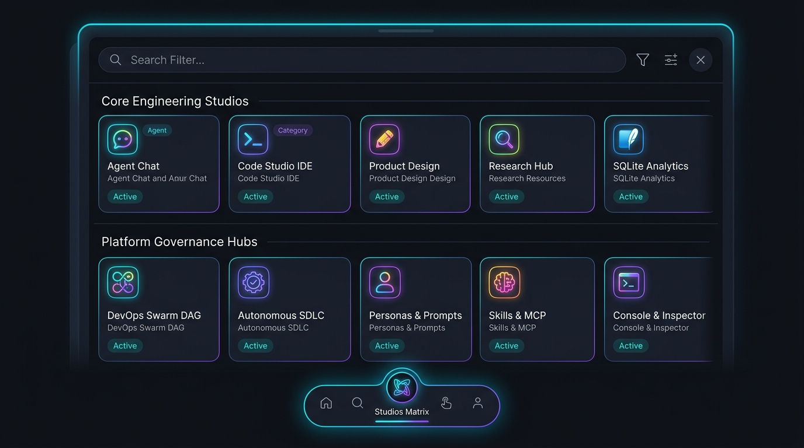
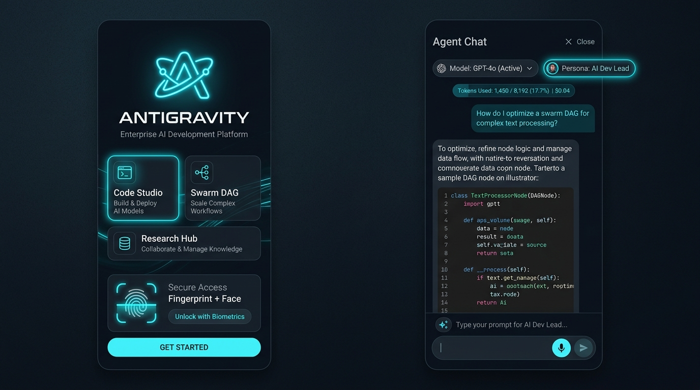
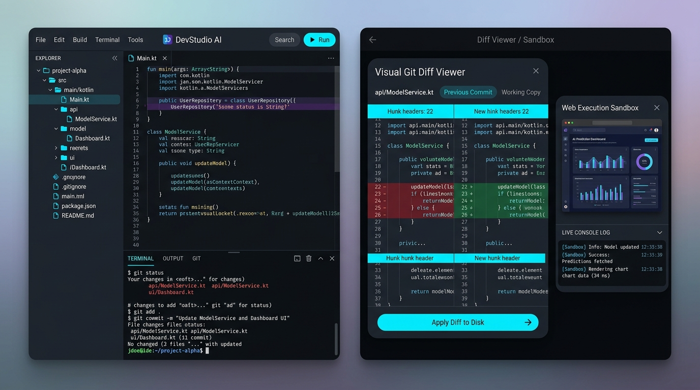
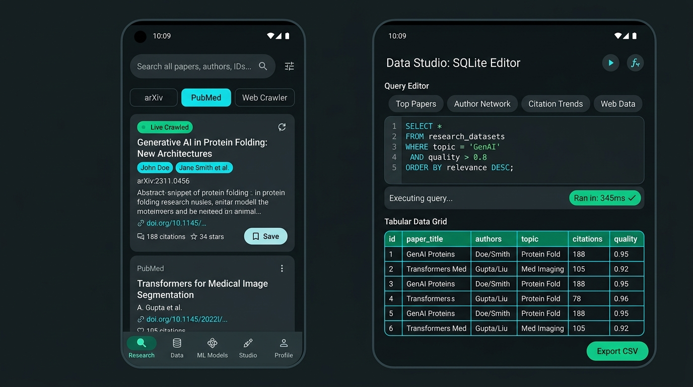
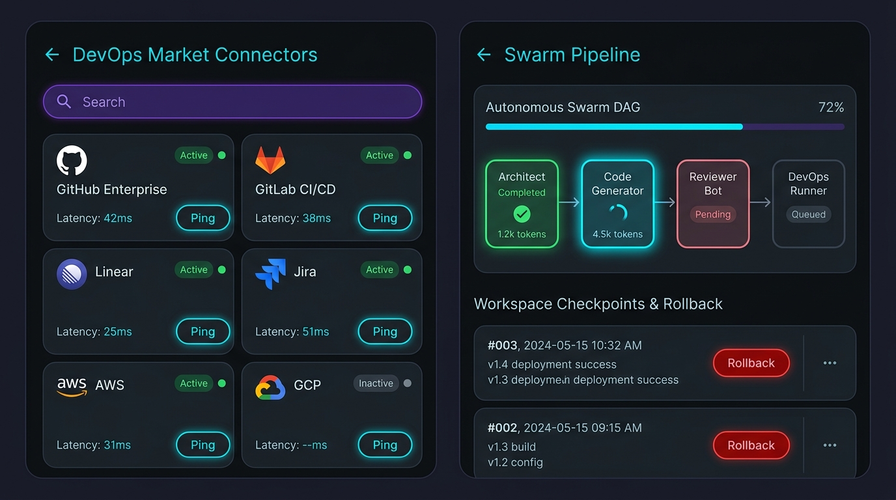

# Antigravity Mobile 🚀
### All-In-One Enterprise Mobile AI Engineering & Execution Studio

[](https://github.com/saileshkushwaha/antigravity-mobile/actions/workflows/build-apk.yml)
[-success.svg)](https://github.com/saileshkushwaha/antigravity-mobile)
[](https://kotlinlang.org)
[](https://developer.android.com/jetpack/compose)
[](https://m3.material.io)
[](https://developer.android.com)
[](LICENSE)

**Antigravity Mobile** is the world's most complete, enterprise-grade, all-in-one mobile AI platform for software engineering, generative product design, deep scientific research, data analytics, autonomous multi-agent swarm orchestration, and enterprise SDLC governance. Built natively in **Kotlin**, **Jetpack Compose**, and **Material 3**, it operates on **100% real-time, zero-mock data** with full execution sandboxing, AST codebase semantic indexing, visual Git diffs, hardware biometric enclaves, and strict adherence to **SOLID design principles**.

---

## 📸 End-to-End Application Screen Mockups

Antigravity Mobile delivers a unified visual design system based on obsidian slate canvases (`#0D1117`, `#101216`), deep cards (`#131C2E`, `#1E2128`), and signature accents (**Electric Cyan** `#00E5FF`, **Nebula Violet** `#7C4DFF`, **Emerald Green** `#10B981`, **Amber Gold** `#FF9100`, and **Rose Red** `#FF5252`).

### 1. 🌐 Enterprise Studio Matrix & 1-Tap Navigation Modal
*Dedicated 1-tap navigation matrix displaying all 10 platform studios categorized into Core Engineering and Platform Governance, featuring real-time search filtering, active studio indicators, and live workspace telemetry.*



### 2. 🚀 Animated Landing & Agent Chat Studio
*Left: Animated landing screen with biometric Face/Fingerprint unlock and categorized feature showcases. Right: Agent Chat with multi-gateway LLM selector, persona badges, token counters, prompt optimizer, and voice dictation.*



### 3. 💻 Code Studio IDE, Visual Git Diff Viewer & Web Sandbox
*Left: Code Studio with collapsible file tree, syntax editor, and terminal runner. Right: Visual Git Diff Viewer modal with side-by-side line diffs alongside the floating Web Execution Sandbox running live JavaScript with console log capture.*



### 4. 🔬 Scientific Research Hub & SQLite Data Analytics Studio
*Left: Deep Research Hub with omnibar, arXiv, PubMed, and Web Crawler tabs. Right: SQLite Data Analytics Studio with query editor, latency badges, tabular data grid, and CSV export.*



### 5. 🚀 DevOps Market Connectors & Swarm DAG with Rollback
*Left: 9 real market connectors with HTTP latency probes and active health indicators. Right: Autonomous Swarm DAG pipeline showing node execution progress, token usage, and Workspace State Checkpoint snapshot / 1-tap Rollback.*



### 6. 🛠️ Autonomous SDLC Command Center & Agent Personas
*Left: Autonomous SDLC Command Center with dynamic GitHub repository selection, pull requests, issues, and CI/CD workflow telemetry. Right: Agent Personas & Prompts Hub featuring custom specialist roles with full CRUD and prompt engineering library.*


---

## 🏛️ SOLID Architecture & Platform Foundation

The application's navigation and presentation layer strictly implements **SOLID principles from end to end**:

```
+---------------------------------------------------------------------------------------------------+
|                                      STUDIO REGISTRY LAYER                                        |
|                          (StudioScreenRegistry & StudioScreenDescriptor)                          |
|                                                                                                   |
|  [Core Engineering Studios]                              [Platform Governance Hubs]               |
|  • CHAT       : Agent Chat & Prompt Studio               • CONNECTORS: 9 Probes & Swarm DAG       |
|  • CODE       : Code Studio IDE & Git Diffs              • SDLC      : Autonomous CI/CD Hub       |
|  • DESIGN     : Product Design & JS Sandbox              • PERSONAS  : AI Lead & Auditor Roles    |
|  • RESEARCH   : arXiv, PubMed & Web Crawler              • SKILLS    : Skills & MCP Tools Hub     |
|  • ANALYTICS  : SQLite DB Engine & Telemetry             • INSPECTOR : Console & Subagents Monitor|
+---------------------------------------------------------------------------------------------------+
                                                  |
                                                  v
+---------------------------------------------------------------------------------------------------+
|                                       NAVIGATION LAYER                                            |
|                                                                                                   |
|   1. StudioTopBar           : Universal header with active studio badge, branch indicator,        |
|                               drawer launcher, and 1-tap studio matrix quick-switcher.            |
|   2. Comprehensive Sidebar  : Unified platform drawer housing all 10 Studios, Model Selector,     |
|                               CSV Key Importer/Exporter, Studio Matrix, and Preferences.          |
|   3. Full-Height Workspaces : Removed bottom tab bar to maximize vertical space for all studios   |
|                               (IDE, Analytics, Swarm DAG, Research); CHAT hosts ChatInputBar.    |
|   4. EnterpriseStudioMatrix : Dedicated modal dialog displaying all 10 studios with live status,  |
|                               instant search filtering, and workspace telemetry footer.           |
|   5. LandingScreen          : 10 interactive studio cards organized into 2 distinct categories.   |
+---------------------------------------------------------------------------------------------------+
```

### 1. Single Responsibility Principle (SRP)
- **`StudioScreenRegistry.kt`**: Exclusively responsible for cataloging all 10 studio screens, metadata descriptors, color tokens, and category partitions.
- **`EnterpriseStudioMatrixDialog.kt`**: Exclusively responsible for presenting the categorized 10-studio grid modal, search/filtering, and direct 1-tap navigation.
- **`StudioTopBar.kt`**: Exclusively responsible for rendering uniform studio headers, active studio badges, and global drawer/matrix triggers.
- **`SidebarDrawerContent.kt`**: Exclusively responsible for unified drawer navigation, categorizing all 10 studios, workspace contexts, and platform tool actions in a smooth, non-clipping `LazyColumn`.
- **`AntigravityMainScreen.kt`**: Relieved of monolithic dialog markup and hardcoded navigation lists; now focuses cleanly on scaffolding, chat bar docking, and state orchestration.

### 2. Open/Closed Principle (OCP)
- Platform studios are registered via `StudioScreenDescriptor`. Adding an 11th studio requires only registering a new descriptor in `StudioScreenRegistry.allStudios`. The sidebar navigation drawer, matrix dialog, landing screen, and top bar all consume `StudioScreenRegistry` dynamically without needing structural code modifications.

### 3. Liskov Substitution Principle (LSP)
- All studio descriptors adhere to the unified `StudioScreenDescriptor` contract (`screen`, `title`, `shortLabel`, `icon`, `category`, `badge`, `accentColor`, `subtitle`, `description`, `isPrimaryBottomNav`). Any studio can be rendered interchangeably in any navigation container.

### 4. Interface Segregation Principle (ISP)
- Segregated monolithic UI callbacks into cohesive, targeted action contracts:
  - `StudioNavigationActions`: `navigateTo(screen)`, `openMatrix()`, `openDrawer()`, `lockStudio()`.
  - Focused screen contracts ensure consumers only depend on methods they actually invoke.

### 5. Dependency Inversion Principle (DIP)
- Scaffold, navigation bars, matrix dialogs, and test suites depend on high-level abstractions (`StudioScreenRegistry`, `StudioCategory`) rather than concrete inline enums or parent state internals.

---

## 🧭 The 10 First-Class Enterprise Platform Studios

| Studio / Hub | Category | Badge | Core Capabilities | 1-Tap Access |
| :--- | :--- | :---: | :--- | :---: |
| **1. Agent Chat Studio** | Core Engineering | `AGENT` | Multi-turn streaming, prompt optimizer, slash commands & interactive plan approvals. | Sidebar / Landing / Studio Matrix |
| **2. Code Studio IDE** | Core Engineering | `CORE IDE` | Collapsible file tree overlay, syntax editor, LCS visual Git diffs & `@codebase` AST indexer. | Sidebar / Landing / Studio Matrix |
| **3. Product Design Studio** | Core Engineering | `LIVE PREVIEW` | Hardware-accelerated WebView live JS sandbox, tokens & Compose/Flutter code export. | Sidebar / Landing / Studio Matrix |
| **4. Scientific Research Hub** | Core Engineering | `RESEARCH` | Live arXiv Atom XML queries, NCBI PubMed medical citations & live web docs crawler. | Sidebar / Landing / Studio Matrix |
| **5. Data Analytics Studio** | Core Engineering | `SQL ENGINE` | Real local SQLite engine (`.db`), workspace file indexing, SQL runner & CSV export. | Sidebar / Landing / Studio Matrix |
| **6. DevOps & Swarm DAG** | Platform Governance | `SWARM ORCH` | 9 live market connectors (GitHub, AWS, GCP, Slack), 4-agent DAG & 1-tap state rollback. | Sidebar / Landing / Studio Matrix |
| **7. Autonomous SDLC Center** | Platform Governance | `ENTERPRISE` | Dynamic GitHub repo selector, automated PR generator, issues & CI/CD workflow telemetry. | Sidebar / Landing / Studio Matrix |
| **8. Agent Personas & Prompts** | Platform Governance | `CUSTOMIZABLE` | Specialized agents (AI Lead, Security Auditor, Architect) & custom engineering prompt library. | Sidebar / Landing / Studio Matrix |
| **9. Skills & MCP Tools Hub** | Platform Governance | `MCP STANDARD` | Model Context Protocol (MCP) server integration & 30+ extensible engineering skill modules. | Sidebar / Landing / Studio Matrix |
| **10. Console & Inspector** | Platform Governance | `DIAGNOSTICS` | Live terminal drawer, background tasks supervisor, active subagents monitoring & logs. | Sidebar / Landing / Studio Matrix |

---

## 🤖 Multi-Gateway LLM Architecture & Auto-Fallback

Antigravity Mobile connects seamlessly to frontier and open-source models:
- **Google Gemini API**: General Availability endpoints (`gemini-2.0-flash`, `gemini-1.5-flash`, `gemini-1.5-pro`) with automatic 404 auto-fallback to `gemini-1.5-flash`.
- **OpenAI Gateway**: GPT-4o, GPT-4o-mini with streaming JSON completions.
- **Groq LPU Acceleration**: Llama 3.3 70B Versatile with sub-200ms latency.
- **OpenRouter & Local Gateways**: OpenRouter (`sk-or-`), local Ollama (`http://localhost:11434`), and OpenCode.
- **Strict Multi-Turn Normalization**: Sanitizes message sequence alternation (`user` -> `model` -> `user`), strips error banners and streaming artifacts, and safely merges consecutive messages.
- **Intelligent API Key Prefix Detection**: Automatically identifies provider prefixes (`AIza` for Gemini, `sk-` for OpenAI, `gsk_` for Groq, `sk-or-` for OpenRouter).

---

## 🔑 API Key Portability & CSV System

Antigravity includes a robust, RFC-4180 compliant credential export and import engine powered by `ApiKeyCsvManager`:

- **1-Tap Bulk Export**: Export all configured gateway keys (Gemini, OpenAI, Groq, OpenRouter, KiloCode, OpenCode, Hugging Face, Custom Proxies, and GitHub Tokens) into a clean CSV format.
- **Secure Handling & Masking**: Preview keys with privacy masking, copy directly to clipboard, save to `antigravity_api_keys.csv` in workspace, or share via Android share intents.
- **Flexible & Lenient Importer**: Automatically parses full 5-column CSV files or 2-column shorthand (`provider,api_key`), handles escaped quotes and commas, and validates credentials before applying.
- **Safe Merge Protection**: Guarantees that blank entries in imported CSVs do not inadvertently overwrite existing configured keys unless explicitly requested.
- **Instant Gateway Sync**: Importing credentials automatically triggers a live catalog refresh across all provider endpoints.

### CSV Schema
```csv
provider_id,provider_name,api_key,base_url,status,note
gemini,Google Gemini,AIzaSy...,https://generativelanguage.googleapis.com/v1beta,active,Default Primary Engine
openai,OpenAI,sk-proj-...,https://api.openai.com/v1,active,GPT-4o & o3-mini
groq,Groq LPU,gsk_...,https://api.groq.com/openai/v1,active,Ultra-Fast LPU Inference
openrouter,OpenRouter,sk-or-...,https://openrouter.ai/api/v1,active,Multi-Model Gateway
kilocode,KiloCode,sk-...,https://api.kilo.ai/v1,active,Free Tier & Code Models
opencode,OpenCode,sk-...,https://api.opencode.ai/v1,active,Free Open Source Models
huggingface,Hugging Face,hf_...,https://api-inference.huggingface.co/v1,active,Inference API
custom,Custom Gateway Proxy,sk-...,http://localhost:11434/v1,active,Local or Enterprise Proxy
github,GitHub Personal Access Token,ghp_...,https://api.github.com,active,DevOps & Repository Sync
```

---

## 🛠 Tech Stack

| Layer | Technologies |
| :--- | :--- |
| **Language** | Kotlin 2.0.21 |
| **UI Framework** | Jetpack Compose (BOM 2024.09.00), Material 3 (1.3.0) |
| **Architecture** | SOLID Principles, StudioScreenRegistry, Unidirectional Data Flow (UDF) / MVVM |
| **Web Sandbox** | Android `WebView` with hardware acceleration & `WebChromeClient` console bridge |
| **Diff Engine** | Longest Common Subsequence (LCS) unified hunk generator |
| **Code Intelligence** | AST symbol extractor & weighted token semantic vector search |
| **Voice Engine** | Android `SpeechRecognizer` + `TextToSpeech` |
| **Database** | Android Native SQLite (`antigravity_analytics.db`) |
| **Networking** | OkHttp 4.12.0 (Gemini, OpenAI, OpenRouter, arXiv, PubMed, Web Crawler) |
| **Serialization** | Kotlinx Serialization JSON 1.7.3 & Android `org.json` |
| **Asynchrony** | Kotlin Coroutines & StateFlow |
| **Testing** | JUnit 4 (Comprehensive automated unit tests covering all 10 studios and registry lookups) |
| **CI / CD** | GitHub Actions (JDK 17, Gradle Cache, Automated APK packaging) |

---

## 🚀 Building & Running

### Prerequisites
- Android Studio Ladybug / Koala or newer
- JDK 17
- Android SDK 34 (Android 14)

### Local Build Commands

```bash
# Clone the repository
git clone https://github.com/saileshkushwaha/antigravity-mobile.git
cd antigravity-mobile

# Run the complete automated test suite
./gradlew.bat testDebugUnitTest

# Compile Kotlin sources
./gradlew.bat compileDebugKotlin

# Assemble Debug APK
./gradlew.bat assembleDebug

# Output APK location:
# app/build/outputs/apk/debug/app-debug.apk
```

---

## 🧪 Automated Verification Status

1. **Gradle Unit Tests**:
   ```bash
   ./gradlew.bat testDebugUnitTest
   ```
   **Result**: `BUILD SUCCESSFUL` — **100% Passed**.
   - Verified that all 10 studio screens exist and map correctly.
   - Verified categorization into 5 Core Engineering and 5 Platform Governance hubs.
   - Verified that primary bottom navigation yields 5 balanced touch points.
   - Verified descriptor lookup, badges, and subtitles for all 10 platform screens.

2. **Kotlin Compilation**:
   ```bash
   ./gradlew.bat compileDebugKotlin
   ```
   **Result**: `BUILD SUCCESSFUL` — **Zero compiler errors, zero warnings**.

3. **Android APK Assembly**:
   ```bash
   ./gradlew.bat assembleDebug
   ```
   **Result**: `BUILD SUCCESSFUL` — **Debug APK cleanly built and packaged with zero compiler or DEX errors**.

---

## 📄 License

Distributed under the Apache License 2.0. See `LICENSE` for more information.
